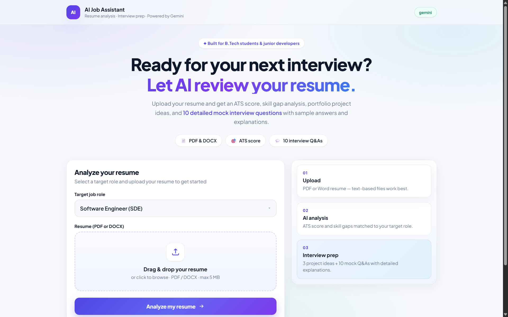
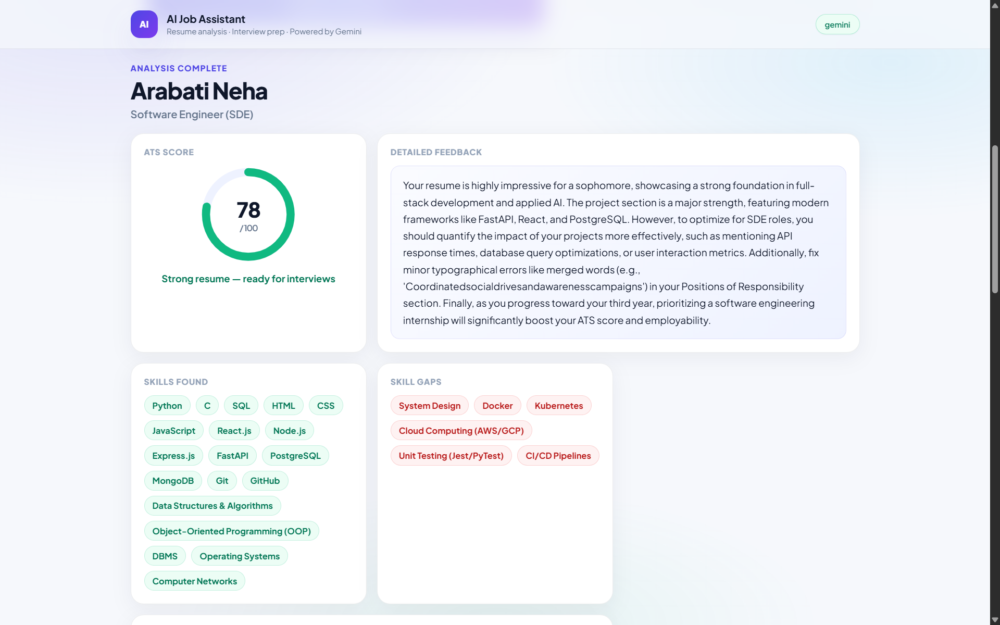
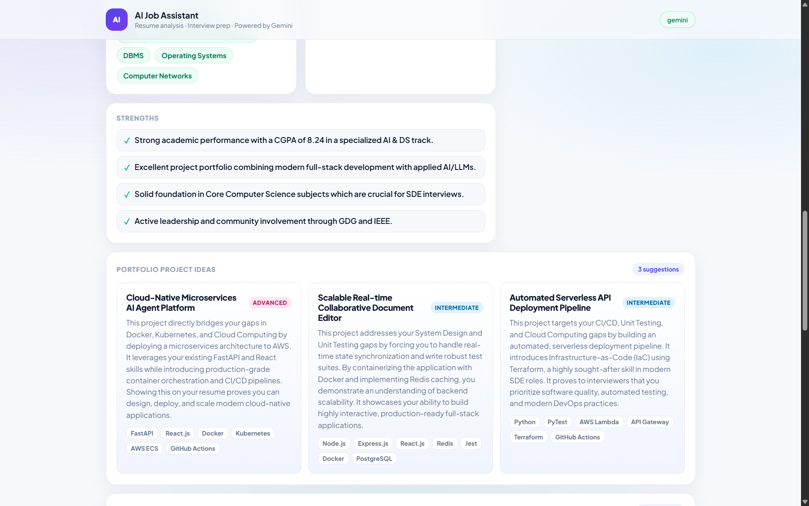
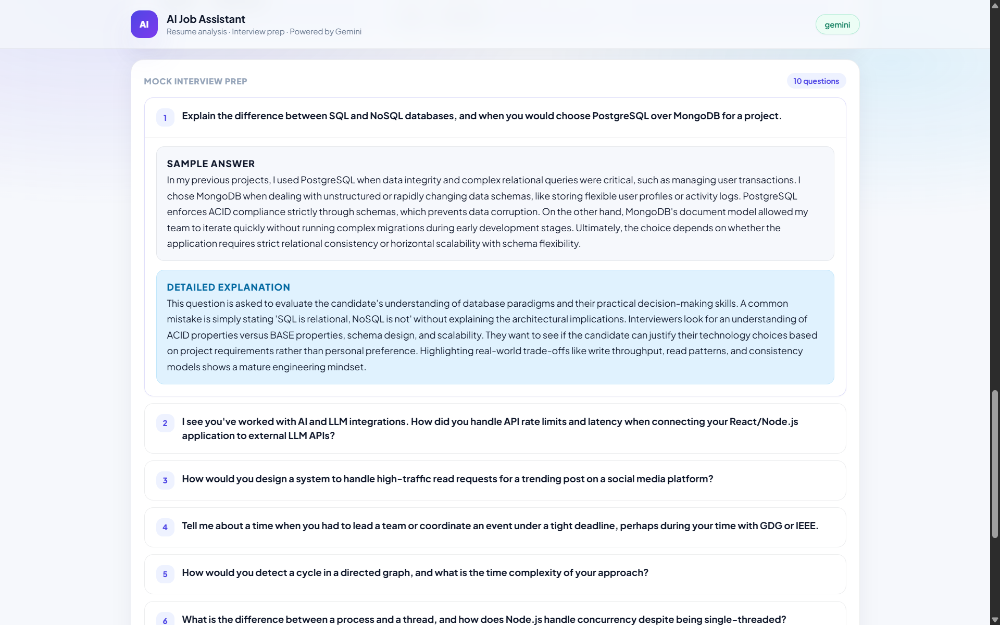
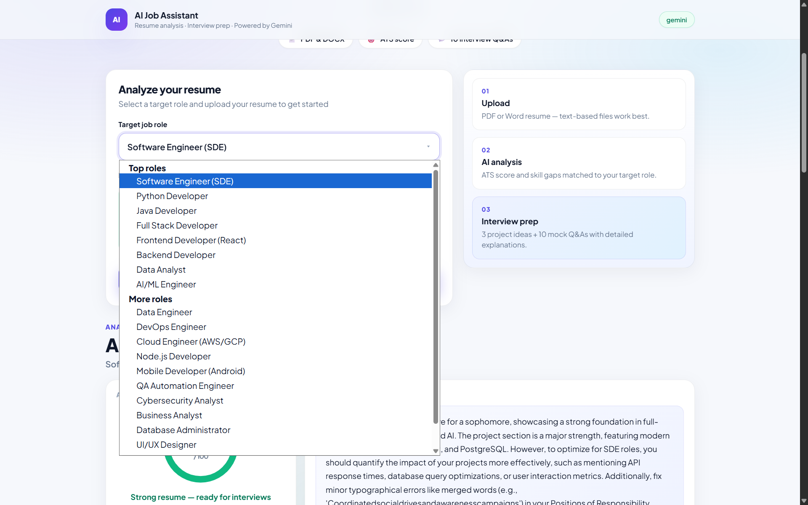

# AI Job Assistant

AI Job Assistant is a web app I built to help students and junior developers understand how well their resume matches a job role.

You can upload a PDF or DOCX resume, select a target role, and get an ATS score, skills you already have, skill gaps, project ideas, and mock interview questions based on that role.

**Author:** Neha Arabati
**GitHub:** [github.com/neha-7218](https://github.com/neha-7218)

## What it does

* Upload a resume in PDF or DOCX format
* Choose from 20 different job roles
* Get an ATS score out of 100
* See the skills found in your resume
* Identify skills that are missing for the selected role
* Get 3 project ideas to improve your portfolio
* Get 10 mock interview questions with sample answers
* Generate a PDF report of the analysis
* Store previous analyses using SQLite

## How it works

1. Upload your resume.
2. Select the role you're preparing for.
3. The app extracts the text from your resume.
4. Gemini analyzes the resume based on the selected role.
5. The results are displayed on the website.
6. You can generate a PDF report of the results.

## Tech Stack

**Backend**

* Python
* FastAPI

**AI**

* Gemini API

**Resume Parsing**

* pdfplumber
* python-docx

**Database**

* SQLite

**Frontend**

* HTML
* CSS
* JavaScript

**Other**

* Docker
* Git & GitHub

## Screenshots

### Home



### Resume Analysis



### Analysis Results



### Mock Interview Preparation



### Available Roles



## Run Locally

Clone the repository:

```bash
git clone https://github.com/neha-7218/ai-job-assistant.git
cd ai-job-assistant
```

Create and activate a virtual environment:

```bash
python3.11 -m venv .venv
source .venv/bin/activate
```

Install the dependencies:

```bash
pip install -r requirements.txt
```

Create a `.env` file and add your Gemini API key:

```env
GEMINI_API_KEY=your-key
LLM_PROVIDER=gemini
MODEL=gemini-3.5-flash
```

Then start the application:

```bash
python -m uvicorn app.main:app --reload
```

Open:

```text
http://localhost:8000
```

## API Endpoints

| Method | Endpoint       | Purpose                     |
| ------ | -------------- | --------------------------- |
| GET    | `/`            | Web application             |
| GET    | `/api/health`  | Check application/AI status |
| GET    | `/api/roles`   | Get available job roles     |
| GET    | `/api/recent`  | Get recent analyses         |
| POST   | `/api/analyze` | Upload and analyze a resume |
| POST   | `/api/report`  | Generate the PDF report     |

## Deployment

The application is Docker-ready and can be deployed as a web service on Render.

### Live Demo

[Try the Live Demo](https://ai-job-assistant-akpt.onrender.com/)

## Project Structure

```text
ai-job-assistant/
├── app/
│   ├── main.py
│   ├── analyzer.py
│   ├── config.py
│   ├── db.py
│   ├── models.py
│   ├── resume_parser.py
│   ├── llm/
│   │   ├── client.py
│   │   └── prompts.py
│   └── static/
├── data/
├── scripts/
├── tests/
├── Dockerfile
├── requirements.txt
└── run.sh
```

## A few things I learned from building it

This project gave me hands-on experience with FastAPI, working with uploaded files, extracting text from PDFs and DOCX files, integrating an LLM API, handling structured AI responses, storing results in SQLite, and generating PDF reports.

I also had to debug things like Python package imports, API quota errors, and PDF text formatting while getting the application running locally and deploying it.

## Notes

* Resume uploads are limited to 5 MB.
* A Gemini API key is required for AI analysis.
* Avoid uploading resumes or documents containing information you don't want sent to an external AI service.


